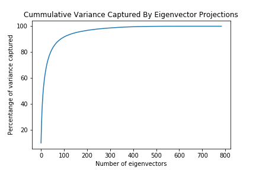
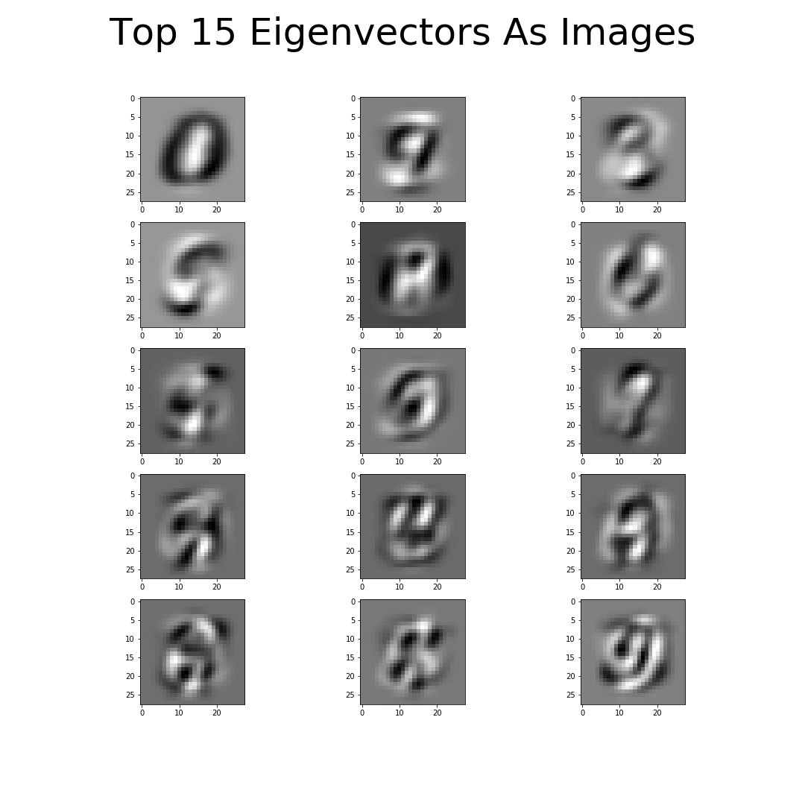
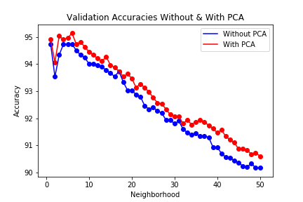

# PCA Based K-Nearest Neighbor Classification of MNIST Data

## MNIST DATASET

28x28 images of digits 0-10 were downloaded. Out of those 15,000 random images were selected for processing.
These were divided into train (60%), validation(20%) and test(20%) sets.
```
# Fetch MNIST dataset
data, labels = fetch_openml('mnist_784', version=1, return_X_y=True)
```
```
# Retain 15,000 random images and divide into train, validation and test
trainX,trainY,valX,valY,testX,testY = prepare_dataset(data,labels,DATA_SPLIT_RATIO=[0.6,0.2,0.2],retain=15000)
```

Eigenvectors and eigenvalues were calculated for the training set. 149 eigenvectors accounting for 95% of the variance were retained.
<p align="center">

</p>

The eigenvectors corresponding to top 15 eigenvalues have been shown below:
<p align="center">

</p>

Completely vectorized implementation of KNN was applied to predict labels on the validation set by comparing against the training data.
Accuracies were calculated for KNN based on PCA features and raw features seperately.
Neighborhood size was varied from 1 to 50 and the optimal value was selected based on validation accuracy.

<p align="center">

</p>

Testing accuracy obtained with optimal neighborhood size was 94.60% and 94.26% for PCA and raw feature based KNN respectively.

### NOTE:
View the python notebook <a href="https://nbviewer.jupyter.org/github/tusharsircar95/PCA-Based-KNN-MNIST-Classification/blob/master/main.ipynb">here</a> in case it doesn't load on Github
